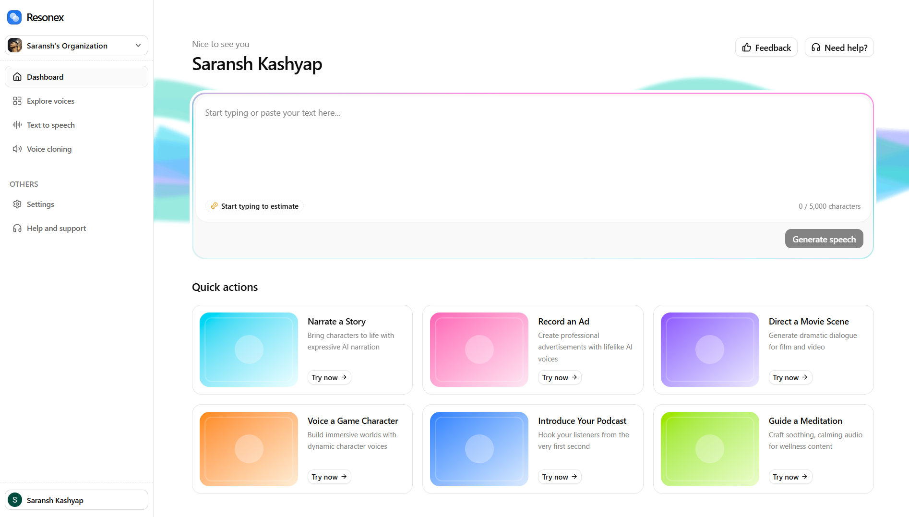

<div align="center">



<br />
<br />

<h1>Resonex</h1>

<p>AI-powered text-to-speech and voice cloning built with Next.js 16, React 19, and Chatterbox TTS.</p>

<p>
  </a>&nbsp;
  </a>&nbsp;
  </a>&nbsp;
  </a>
</p>

</div>

<br />

## Branch


| Branch | Chapter |
|--------|---------|
| `main` | Final project (all chapters combined) |
| `02-dashboard` | Dashboard layout and navigation |
| `03-text-to-speech-ui` | Text-to-speech UI |
| `05-backend-infrastructure` | Backend infrastructure (tRPC, R2, Prisma) |
| `05-voice-selection` | Voice selection and library |
| `06-tts-generation-audio-player` | TTS generation and audio player |
| `07-tts-history-polish` | TTS history and polish |
| `sentry-error-monitoring` | Sentry error monitoring |
| `08-voice-management` | Voice management and cloning |


## Features

- **Text-to-Speech**  - Generate speech from text with adjustable creativity, variety, expression, and flow parameters
- **Zero-Shot Voice Cloning**  - Upload or record a voice sample (10s minimum) and clone it instantly  - no fine-tuning required
- **20 Built-in Voices**  - Pre-seeded system voices across 12 categories and 5 locales
- **Waveform Audio Player**  - WaveSurfer.js visualization with seek, play/pause, and download
- **Multi-Tenant**  - Team-based access via Clerk Organizations with full data isolation
- **Generation History**  - Browse and replay past generations with preserved voice metadata
- **Fully Responsive**  - Mobile-first with bottom drawers, compact controls, and adaptive layouts

## Getting Started

### Prerequisites

- Node.js **20.9** or later
- [Prisma Postgres](https://www.prisma.io/) database
- [Clerk](https://clerk.com/) account (with Organizations enabled)
- [Cloudflare R2](https://www.cloudflare.com/en-in/developer-platform/products/r2/) bucket
- [Modal](https://modal.com/) account (for GPU-hosted TTS)

### 1. Clone and install

```bash
git clone https://github.com/srnsksyp/resonex
npm install
```

### 2. Configure environment

```bash
cp .env.example .env
```

Fill in the blank values in `.env`. Sensible defaults (Clerk routes, `APP_URL`, etc.) are pre-filled.


### 3. Set up the database

```bash
npx prisma migrate deploy
```

### 4. Deploy the TTS engine

The included `chatterbox_tts.py` is adapted from [Modal's official Chatterbox TTS example](https://modal.com/docs/examples/chatterbox_tts), modified to read voice reference audio directly from your R2 bucket instead of a Modal Volume.

Before deploying, update `chatterbox_tts.py` with your R2 credentials:

```python
R2_BUCKET_NAME = "<your-r2-bucket-name-here>"
R2_ACCOUNT_ID = "<your-r2-account-id-here>"
```

Then create the required secrets in your [Modal dashboard]

| Secret Name | Keys | Description |
|-------------|------|-------------|
| `cloudflare-r2` | `AWS_ACCESS_KEY_ID`, `AWS_SECRET_ACCESS_KEY` | R2 API credentials (used for bucket mount) |
| `chatterbox-api-key` | `CHATTERBOX_API_KEY` | API key to protect the endpoint (use any strong random string) |
| `hf-token` | `HF_TOKEN` | Hugging Face token (for downloading the Chatterbox model weights) |

Deploy to Modal:

```bash
modal deploy chatterbox_tts.py
```

This deploys Chatterbox TTS to a serverless NVIDIA A10G GPU on Modal. The container mounts your R2 bucket read-only for direct access to voice reference audio. Use the resulting Modal URL as `CHATTERBOX_API_URL` in your `.env.local`.

> **Note:** The first request after a period of inactivity may take longer due to cold starts as Modal provisions the GPU container.

Once deployed, generate the type-safe Chatterbox client from the OpenAPI spec:

```bash
npm run sync-api
```

### 5. Seed voices

```bash
npx prisma db seed
```

Seeds 20 built-in voices to the database and R2. The system voice WAV files are included in the repository and originate from [Modal's voice sample pack](https://modal-cdn.com/blog/audio/chatterbox-tts-voices.zip).

### 6. Run

```bash
npm run dev
```

Open [http://localhost:3000](http://localhost:3000).

## Self-Hosting

Resonex is designed to be self-hosted. You'll need:

1. **A PostgreSQL database**  - [Prisma Postgres](https://www.prisma.io/) (recommended), or any managed Postgres
2. **Cloudflare R2**  - For audio storage (S3-compatible, generous free tier)
3. **Modal**  - For serverless GPU inference (pay-per-second billing)
4. **Clerk**  - For authentication and multi-tenancy

Deploy the Next.js app to any Node.js host (Vercel, Docker, etc.).

## Project Structure

```
src/
├── app/                        # Next.js App Router
│   ├── (dashboard)/            # Protected routes (home, TTS, voices)
│   ├── api/                    # Audio proxy routes + tRPC handler
│   ├── sign-in/                # Clerk auth pages
│   └── sign-up/
├── components/                 # Shared UI components (shadcn/ui + custom)
├── features/
│   ├── dashboard/              # Home page, quick actions
│   ├── text-to-speech/         # TTS form, audio player, settings, history
│   ├── voices/                 # Voice library, creation, recording               # Usage display, checkout
├── hooks/                      # App-wide hooks
├── lib/                        # Core: db, r2, polar, env, chatterbox client
├── trpc/                       # tRPC routers, client, server helpers
├── generated/                  # Prisma client
└── types/                      # Generated API types
```

## Scripts

| Command | Description |
|---------|-------------|
| `npm run dev` | Start dev server |
| `npm run build` | Production build |
| `npm run start` | Start production server |
| `npm run lint` | Lint with ESLint |
| `npm run sync-api` | Regenerate Chatterbox API types from OpenAPI spec |

## Acknowledgements

- [Chatterbox TTS](https://github.com/resemble-ai/chatterbox) by Resemble AI - the open-source zero-shot voice cloning model powering speech generation
- [Modal](https://modal.com/docs/examples/chatterbox_tts) - serverless GPU deployment example and [voice sample pack](https://modal-cdn.com/blog/audio/chatterbox-tts-voices.zip)